# Quickvnt — Plataforma Móvil de Gestión de Eventos MICE

<!-- TODO: Reemplazar con el banner del proyecto -->
<!--  -->

<p align="center">
  
</p>

<p align="center">
  <strong>Proyecto Final — Desarrollo Móvil</strong><br>
  <strong>Grupo Quickvnt · Salón 1SF-241</strong><br>
  App Android nativa para la gestión integral de eventos corporativos, conferencias y ferias (MICE).
</p>

<p align="center">
  
  
  
  
  
</p>

<p align="center">
  <a href="#-demo-en-video">Demo</a> •
  <a href="#-capturas-de-pantalla">Capturas</a> •
  <a href="#-equipo">Equipo</a> •
  <a href="#-instalación">Instalación</a> •
  <a href="docs/">Documentación</a>
</p>

---

## 📋 Índice

- [Descripción del proyecto](#-descripción-del-proyecto)
- [Problema y solución](#-problema-y-solución)
- [Demo en video](#-demo-en-video)
- [Capturas de pantalla](#-capturas-de-pantalla)
- [Funcionalidades](#-funcionalidades)
- [Roles de usuario](#-roles-de-usuario)
- [Stack tecnológico](#-stack-tecnológico)
- [Arquitectura](#-arquitectura)
- [Equipo](#-equipo)
- [Instalación](#-instalación)
- [Estructura del repositorio](#-estructura-del-repositorio)
- [Documentación adicional](#-documentación-adicional)
- [Repositorio único en GitHub](#-repositorio-único-en-github)
- [Licencia](#-licencia)

---

## 🎯 Descripción del proyecto

**Quickvnt** es una plataforma móvil que conecta **asistentes**, **organizadores** y **staff** en un mismo ecosistema para eventos MICE (*Meetings, Incentives, Conferences & Exhibitions*).

La aplicación Android permite:

- Explorar y registrarse en eventos publicados
- Gestionar tickets digitales con código QR
- Crear y administrar eventos (organizadores)
- Validar asistencia mediante escáner QR (staff)
- Consultar métricas y analytics en tiempo real

> **Repositorio:** [Proyecto-final-ultimate-movil-BE](https://github.com/ElRulios/Proyecto-final-ultimate-movil-BE)

---

## 💡 Problema y solución

### Problema

<!-- TODO: Completar con el contexto de tu curso / empresa / caso de uso -->

| Aspecto | Situación actual |
|---------|------------------|
| Registro a eventos | Procesos manuales, formularios en papel o correo |
| Control de acceso | Listas impresas, filas largas en entrada |
| Organización | Herramientas dispersas (Excel, WhatsApp, email) |
| Métricas | Difícil medir asistencia y engagement en tiempo real |

### Solución propuesta

Quickvnt centraliza el ciclo de vida del evento en una app móvil moderna:

```text
Publicar evento → Registro en línea → Ticket QR → Check-in digital → Analytics
```

---

## 🎬 Demo en video

Demos grabadas en `docs/assets/videos/` (formato WebM).

### Inicio y autenticación

<p align="center">
  <video src="./docs/assets/videos/inicio.webm" controls width="600">
    <a href="./docs/assets/videos/inicio.webm">Ver demo — inicio y autenticación</a>
  </video>
</p>

<p align="center"><em>▶️ <code>inicio.webm</code> — pantalla de bienvenida, login y registro</em></p>

### Flujo asistente (ATTENDEE)

<p align="center">
  <video src="./docs/assets/videos/atendee.webm" controls width="600">
    <a href="./docs/assets/videos/atendee.webm">Ver demo — asistente</a>
  </video>
</p>

<p align="center"><em>▶️ <code>atendee.webm</code> — marketplace, registro a evento, tickets y QR</em></p>

### Flujo organizador (ORGANIZER)

<p align="center">
  <video src="./docs/assets/videos/organizer.webm" controls width="600">
    <a href="./docs/assets/videos/organizer.webm">Ver demo — organizador</a>
  </video>
</p>

<p align="center"><em>▶️ <code>organizer.webm</code> — crear evento, panel, analytics, staff y check-in QR</em></p>

### Videos por rol

| Rol | Archivo | Contenido |
|-----|---------|-----------|
| Inicio / Auth | [inicio.webm](./docs/assets/videos/inicio.webm) | Bienvenida, login y registro |
| Asistente (ATTENDEE) | [atendee.webm](./docs/assets/videos/atendee.webm) | Marketplace, tickets y QR |
| Organizador (ORGANIZER) | [organizer.webm](./docs/assets/videos/organizer.webm) | CRUD eventos, analytics, staff, QR |

[Galería completa de capturas y videos →](./docs/06-galeria.md)

---

## 📸 Capturas de pantalla

Todas las capturas en `docs/assets/screenshots/`. [Galería completa →](./docs/06-galeria.md)

### Raíz — `screenshots/`

| `pantalla_de_inicio.png` | `inicio_de_sesion.png` | `registro.png` |
|:---:|:---:|:---:|
| 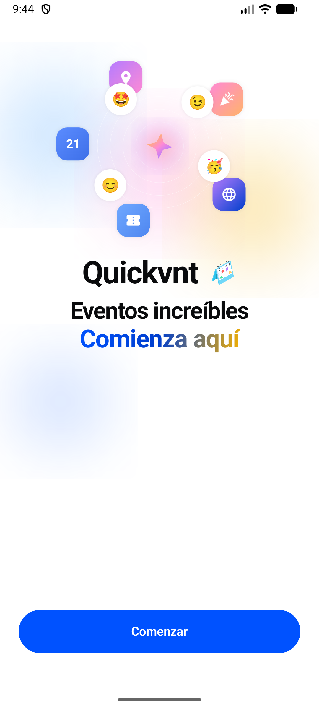 | 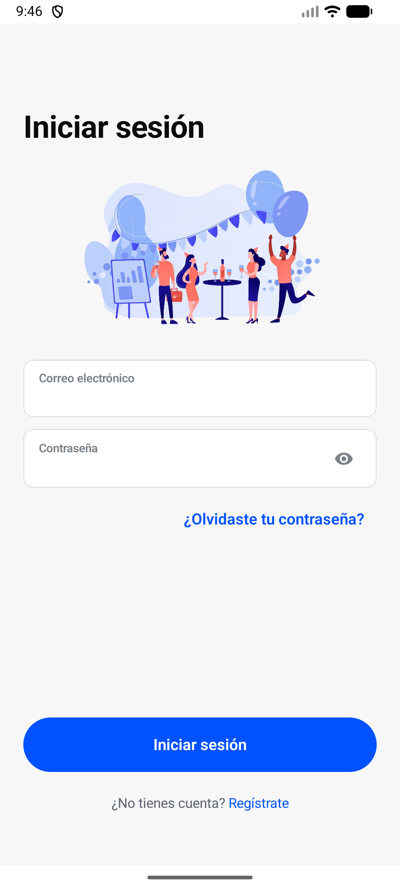 | 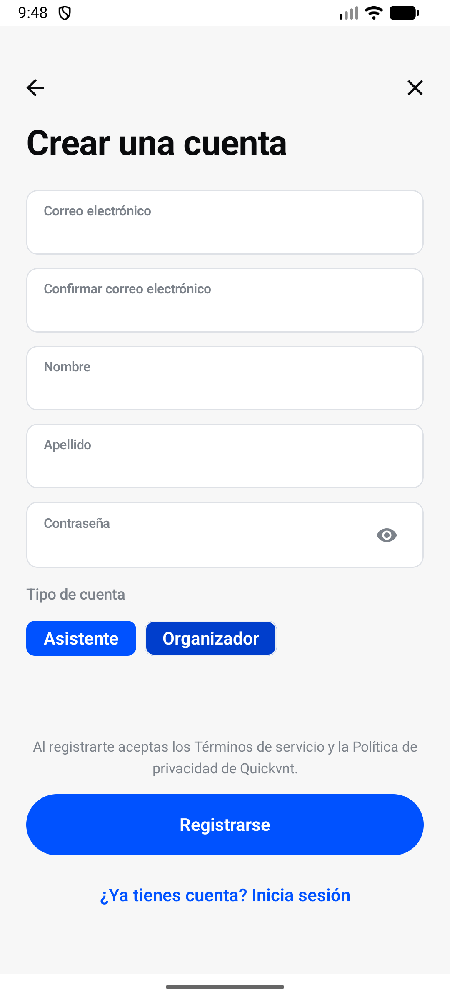 |

| `perfil.png` | | |
|:---:|:---:|:---:|
| 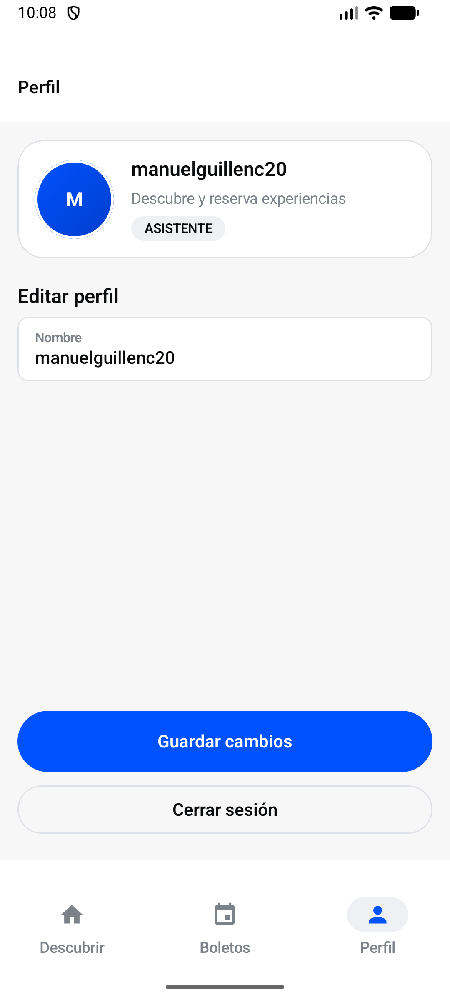 | | |

### Asistente — `screenshots/atendee/`

| `marketplace.png` | `pantalla_de_evento.png` | `boletos.png` |
|:---:|:---:|:---:|
| 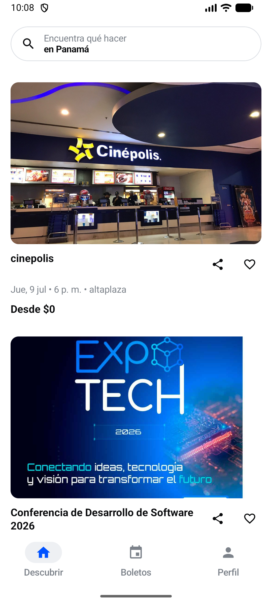 | 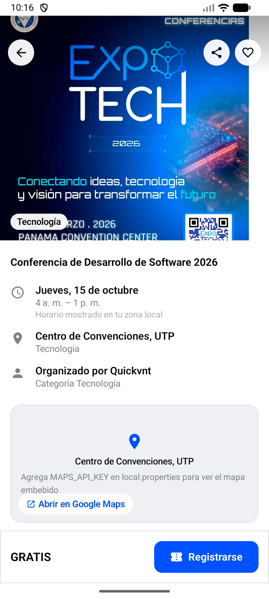 | 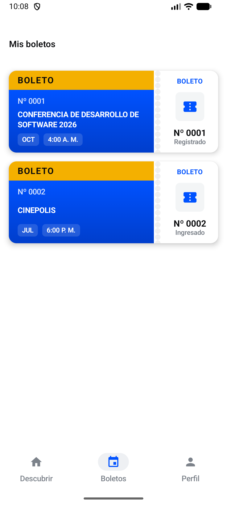 |

| `boleto_pantalla.png` | | |
|:---:|:---:|:---:|
| 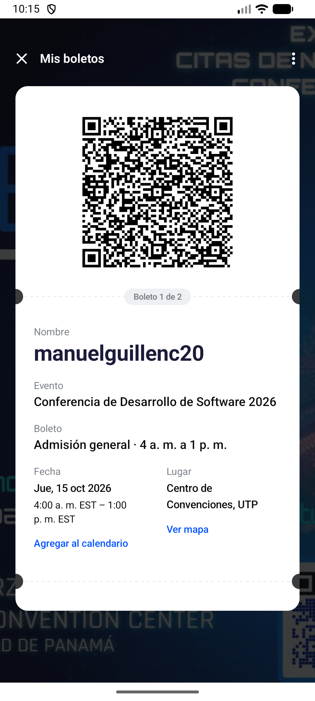 | | |

### Organizador — `screenshots/organizer/`

| `panel_de_organizador.png` | `crear_evento.png` | `dashboard_de_evento.png` |
|:---:|:---:|:---:|
| 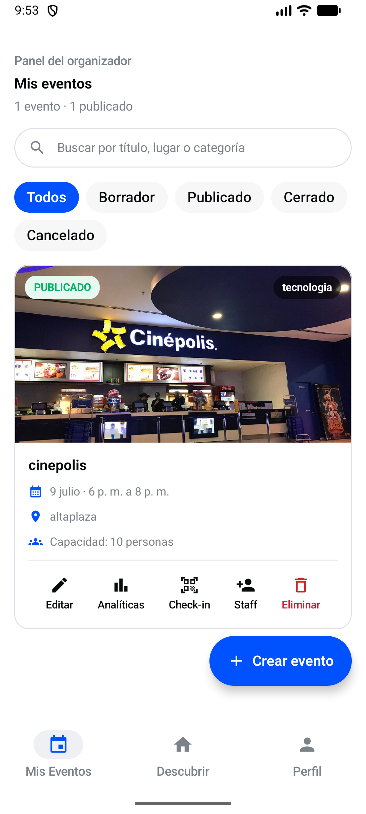 | 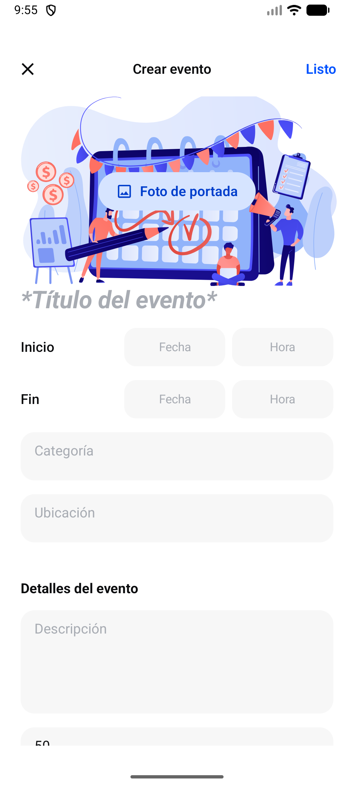 | 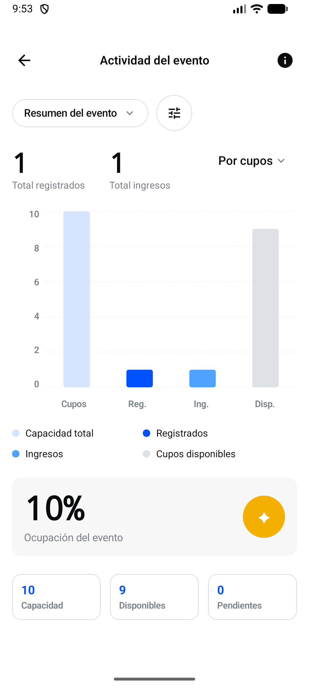 |

| `gestion_de_staff.png` | `registroqr.png` | |
|:---:|:---:|:---:|
| 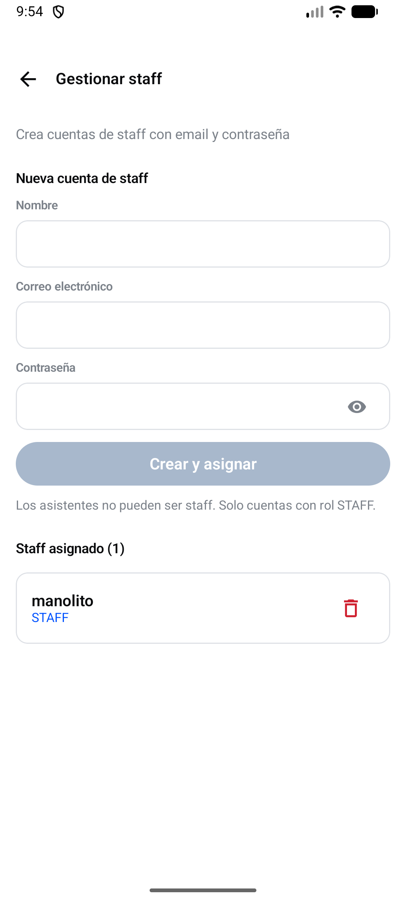 | 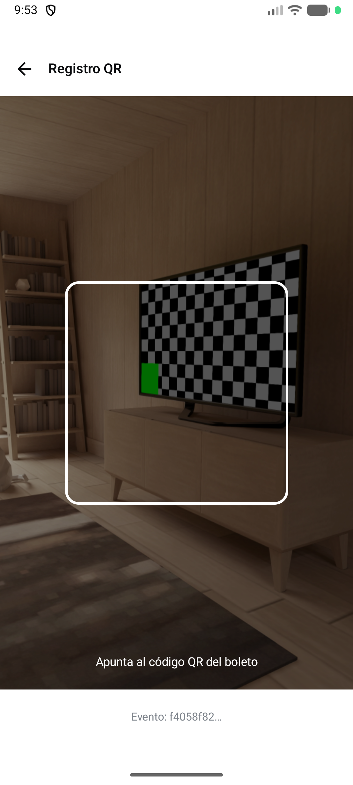 | |

### Staff — `screenshots/Staff/`

| `pantalla_de_staff.png` | | |
|:---:|:---:|:---:|
| 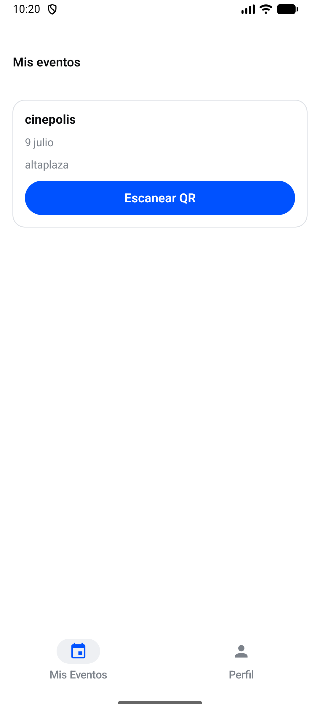 | | |

---

## ✨ Funcionalidades

| Módulo | Descripción | Rol |
|--------|-------------|-----|
| 🔐 Autenticación | Login, registro y sesión JWT persistente | Todos |
| 🏪 Marketplace | Explorar eventos por categoría y estado | ATTENDEE |
| 🎫 Tickets | Registro a eventos, mis tickets, QR digital | ATTENDEE |
| 📅 Mis eventos | CRUD completo de eventos | ORGANIZER |
| 👥 Gestión staff | Asignar personal a eventos | ORGANIZER |
| 📊 Analytics | KPIs: registros, check-ins, ocupación | ORGANIZER |
| 📷 Check-in QR | Escáner para validar asistencia | STAFF / ORGANIZER |
| 👤 Perfil | Datos de usuario y cierre de sesión | Todos |
| 🗺️ Mapa | Ubicación del evento (Google Maps) | ATTENDEE |

---

## 👥 Roles de usuario

```text
┌─────────────┐     ┌──────────────┐     ┌─────────────┐
│  ATTENDEE   │     │  ORGANIZER   │     │    STAFF    │
│  Asistente  │     │ Organizador  │     │   Personal  │
└──────┬──────┘     └──────┬───────┘     └──────┬──────┘
       │                   │                    │
       ▼                   ▼                    ▼
  Marketplace          Mis Eventos          Staff Events
  Mis Tickets          Analytics            QR Scanner
  Perfil               Marketplace          Perfil
                       QR Scanner
                       Perfil
```

---

## 🛠 Stack tecnológico

### Frontend (esta carpeta)

| Tecnología | Uso |
|------------|-----|
| **Kotlin** | Lenguaje principal |
| **Jetpack Compose** | UI declarativa |
| **Material 3** | Sistema de diseño |
| **Retrofit + OkHttp** | Cliente HTTP / API REST |
| **Moshi** | Serialización JSON |
| **Navigation Compose** | Navegación entre pantallas |
| **DataStore** | Persistencia de token JWT |
| **Coil** | Carga de imágenes |
| **ZXing** | Generación y escaneo QR |
| **Google Maps Compose** | Mapas en detalle de evento |
| **MVVM** | Patrón de arquitectura |

### Backend (mismo repositorio)

| Tecnología | Uso |
|------------|-----|
| **FastAPI** | API REST |
| **PostgreSQL** | Base de datos |
| **JWT** | Autenticación |
| **Render** | Despliegue en producción |

**API en producción:** `https://pruebasemestral.onrender.com/api/v1/`

---

## 🏗 Arquitectura

<p align="center">
  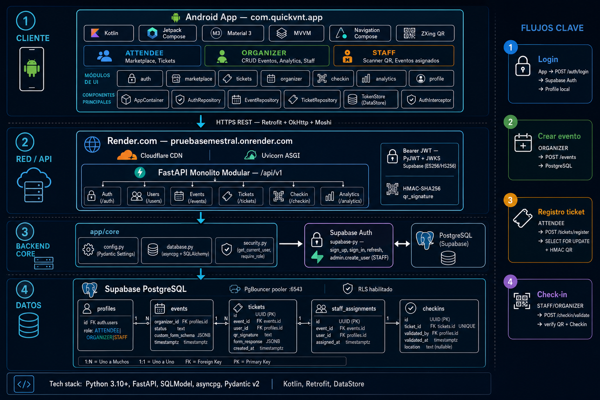
</p>

<p align="center"><em>Quickvnt — arquitectura completa: app Android (MVVM), backend FastAPI y base de datos</em></p>

```text
┌──────────────────────────────────────────────────────────┐
│                    Quickvnt Android App                   │
├──────────────────────────────────────────────────────────┤
│  UI (Compose)  →  ViewModel  →  Repository  →  API DTO  │
├──────────────────────────────────────────────────────────┤
│  core/network (Retrofit)  │  core/data (TokenStore)       │
└────────────────────────────┬─────────────────────────────┘
                             │ HTTPS / REST
                             ▼
┌──────────────────────────────────────────────────────────┐
│              FastAPI Backend (Render)                     │
│              PostgreSQL + JWT Auth                        │
└──────────────────────────────────────────────────────────┘
```

Detalle en [docs/02-arquitectura.md](./docs/02-arquitectura.md)

---

## 👨‍💻 Equipo

**Grupo:** Quickvnt  
**Salón:** 1SF-241

| Integrante | Cédula |
|------------|--------|
| Fong, Enrique | 4-829-300 |
| González, Jabneel | 8-990-229 |
| Guillén, Manuel | 8-1016-1618 |
| Lu, Joaquín | 8-1024-2466 |
| Santimateo, Diego | 9-764-2382 |
| Pimentel, David | 8-1010-750 |

---

## 🚀 Instalación

### Requisitos previos

- Android Studio Ladybug o superior
- JDK 11+
- Dispositivo Android o emulador (API 26+)
- *(Opcional)* Backend local o usar API en Render

### Pasos rápidos

```bash
# 1. Clonar el repositorio
git clone https://github.com/ElRulios/Proyecto-final-ultimate-movil-BE.git
cd Proyecto-final-ultimate-movil-BE

# 2. Abrir la carpeta del frontend en Android Studio
# (ajusta la ruta según la estructura de tu rama)

# 3. Sincronizar Gradle y ejecutar
./gradlew :app:assembleDebug
```

### Configuración de API

La URL base está en `app/build.gradle.kts`:

| Entorno | URL |
|---------|-----|
| Producción (Render) | `https://pruebasemestral.onrender.com/api/v1/` |
| Emulador local | `http://10.0.2.2:8000/api/v1/` |
| Dispositivo físico | `http://TU_IP_LOCAL:8000/api/v1/` |

### Google Maps (opcional)

Crea `local.properties` en la raíz:

```properties
MAPS_API_KEY=tu_clave_de_google_maps
```

Guía completa: [docs/03-instalacion.md](./docs/03-instalacion.md)

---

## 📁 Estructura del repositorio

```text
.
├── app/                          # Módulo principal Android
│   └── src/main/java/com/example/frontend/
│       ├── core/                 # Red, sesión, utilidades
│       ├── data/                 # DTOs y repositorios
│       ├── navigation/           # Rutas y NavHost
│       └── ui/                   # Pantallas Compose por módulo
├── docs/                         # Documentación del proyecto
│   ├── assets/                   # arquitectura.png, screenshots, videos
│   ├── 01-proyecto.md
│   ├── 02-arquitectura.md
│   ├── 03-instalacion.md
│   ├── 04-manual-usuario.md
│   ├── 05-api-integracion.md
│   ├── 06-galeria.md
│   └── 07-presentacion.md
├── gradle/
├── build.gradle.kts
├── settings.gradle.kts
└── README.md                     # Este archivo
```

---

## 📚 Documentación adicional

| Documento | Contenido |
|-----------|-----------|
| [01 — Proyecto](./docs/01-proyecto.md) | Contexto, objetivos, alcance |
| [02 — Arquitectura](./docs/02-arquitectura.md) | Capas, patrones, diagramas |
| [03 — Instalación](./docs/03-instalacion.md) | Setup paso a paso |
| [04 — Manual de usuario](./docs/04-manual-usuario.md) | Guía por pantalla |
| [05 — API e integración](./docs/05-api-integracion.md) | Endpoints consumidos |
| [06 — Galería](./docs/06-galeria.md) | Screenshots y videos |
| [07 — Presentación](./docs/07-presentacion.md) | Guía para presentación en GitHub |

---

## 📦 Repositorio único en GitHub

Este proyecto cumple el requisito de **un solo repositorio** en GitHub que contiene:

| Componente | Ubicación en el repo | Rama sugerida |
|------------|----------------------|---------------|
| Backend (FastAPI) | Raíz / `app/` | `master` |
| Frontend Android | Esta carpeta | `android` |
| Documentación | `docs/` + `README.md` | Todas |
| Base de datos | `schema.sql`, `migrations/` | `master` |

**URL del repositorio:** https://github.com/ElRulios/Proyecto-final-ultimate-movil-BE

---

## 📄 Licencia

<!-- TODO: Elegir licencia — MIT es común para proyectos académicos -->

Este proyecto fue desarrollado con fines académicos.

**Licencia:** [MIT](./LICENSE) *(pendiente de crear si aplica)*

---

<p align="center">
  <strong>Quickvnt</strong> — Gestión inteligente de eventos MICE<br>
  <em>Grupo Quickvnt · Salón 1SF-241 · Proyecto Final · Desarrollo Móvil</em>
</p>
