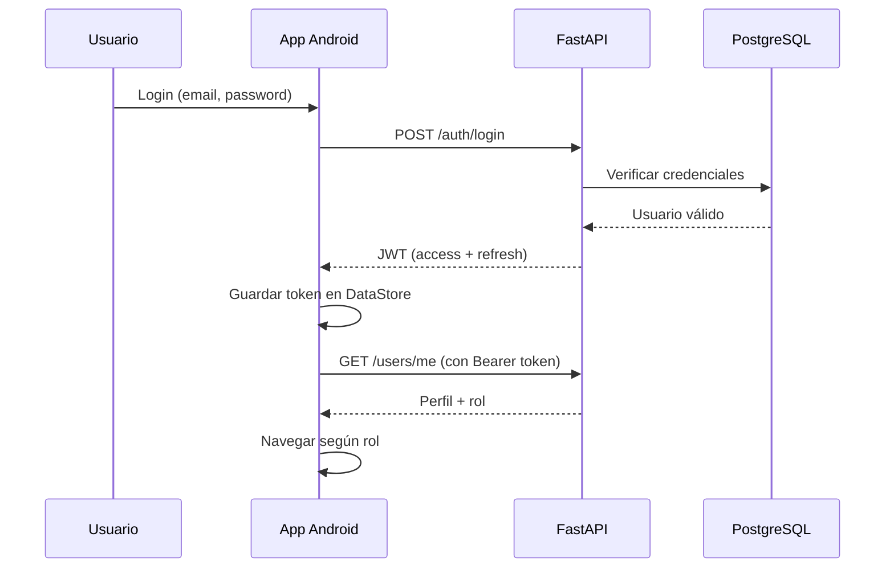

# 02 — Arquitectura

> **Grupo:** Quickvnt · **Salón:** 1SF-241

## Visión general

Quickvnt sigue una arquitectura **cliente-servidor** con la app Android como cliente y FastAPI como servidor.


---

## Arquitectura del cliente (Android)

### Patrón: MVVM + Repository

```text
┌─────────────────────────────────────────────────────────┐
│                        UI Layer                          │
│  Composable Screens  +  ViewModels  +  UI State          │
├─────────────────────────────────────────────────────────┤
│                      Domain Layer                        │
│              Repositories (Auth, Event, Ticket)          │
├─────────────────────────────────────────────────────────┤
│                       Data Layer                         │
│   QuickvntApi (Retrofit)  │  TokenStore (DataStore)      │
│   DTOs (Moshi)            │  AuthInterceptor             │
└─────────────────────────────────────────────────────────┘
```

Ver diagrama completo al inicio de este documento: [arquitectura.png](assets/arquitectura.png).

### Estructura de paquetes

```text
com.example.frontend/
├── core/
│   ├── AppContainer.kt          # Inyección de dependencias manual
│   ├── ViewModelFactory.kt
│   ├── data/
│   │   └── TokenStore.kt        # Persistencia JWT (DataStore)
│   ├── network/
│   │   ├── QuickvntApi.kt       # Interface Retrofit
│   │   ├── AuthInterceptor.kt   # Header Authorization
│   │   ├── NetworkDns.kt
│   │   └── NetworkErrors.kt
│   └── util/
│       ├── QrCodeUtils.kt
│       ├── FormSchemaParser.kt
│       └── StatusLabels.kt
├── data/
│   ├── dto/                     # Data Transfer Objects
│   └── repository/              # Auth, Event, Ticket
├── navigation/
│   ├── Routes.kt
│   └── QuickvntNavHost.kt
└── ui/
    ├── auth/
    ├── marketplace/
    ├── tickets/
    ├── organizer/
    ├── staff/
    ├── checkin/
    ├── analytics/
    ├── profile/
    ├── splash/
    ├── components/
    └── theme/
```

---

## Arquitectura del servidor (Backend)

```text
┌──────────────────────────────────────────┐
│              FastAPI (Python)             │
├──────────────────────────────────────────┤
│  Routers: auth, events, tickets,          │
│           checkin, analytics, users       │
├──────────────────────────────────────────┤
│  Services + Models (SQLAlchemy/Pydantic)  │
├──────────────────────────────────────────┤
│           PostgreSQL Database             │
└──────────────────────────────────────────┘
         Desplegado en Render
```

**URL producción:** `https://pruebasemestral.onrender.com/api/v1/`

---

## Flujo de autenticación



---

## Flujo por rol

<!-- TODO: Subir diagrama de flujo -->


| Rol | Pantalla inicial | Flujo principal |
|-----|------------------|-----------------|
| ATTENDEE | Marketplace | Explorar → Registrarse → Ticket QR |
| ORGANIZER | Mis Eventos | Crear evento → Analytics → QR Scanner |
| STAFF | Staff Events | Seleccionar evento → Escanear QR |

---

## Modelo de datos (simplificado)

<!-- TODO: Subir diagrama ER -->


```text
User ─────┬──── Event (organizer)
          ├──── Ticket (attendee)
          ├──── StaffAssignment
          └──── Checkin

Event ────┬──── Ticket
          ├──── StaffAssignment
          └──── Analytics
```

### Entidades principales

| Entidad | Descripción |
|---------|-------------|
| `User` | Usuario con rol (ATTENDEE, ORGANIZER, STAFF) |
| `Event` | Evento con título, fecha, ubicación, categoría, estado |
| `Ticket` | Registro de asistente a un evento |
| `Checkin` | Registro de entrada validada por QR |
| `StaffAssignment` | Asignación de staff a un evento |

---

## Comunicación API

| Aspecto | Implementación |
|---------|----------------|
| Protocolo | HTTPS REST |
| Formato | JSON |
| Auth | Bearer JWT |
| Cliente | Retrofit 2 + OkHttp |
| Serialización | Moshi |
| Timeout / retry | OkHttp interceptors |

---

## Decisiones de diseño

| Decisión | Alternativa considerada | Razón de la elección |
|----------|-------------------------|----------------------|
| Jetpack Compose | XML Views | UI moderna, menos boilerplate |
| MVVM manual | Hilt + Clean Architecture | Simplicidad para MVP académico |
| Retrofit | Ktor Client | Ecosistema maduro, fácil de documentar |
| DataStore | SharedPreferences | API moderna, type-safe |
| DI manual (AppContainer) | Hilt/Dagger | Menor curva de aprendizaje |
| API en Render | AWS / Heroku | Gratuito para demo académica |

---

## Seguridad

- Tokens JWT almacenados en DataStore (no en SharedPreferences plano)
- `AuthInterceptor` agrega `Authorization: Bearer <token>` automáticamente
- HTTPS obligatorio en producción
- `network_security_config.xml` para políticas de red
- Refresh token para renovar sesión

---

## Escalabilidad futura

<!-- TODO: Comentar mejoras planeadas -->

- Migrar a Hilt para DI
- Implementar caché local (Room)
- Paginación en listas largas
- WebSockets para analytics en tiempo real

---

## Equipo — Quickvnt · Salón 1SF-241

| Integrante | Cédula |
|------------|--------|
| Fong, Enrique | 4-829-300 |
| González, Jabneel | 8-990-229 |
| Guillén, Manuel | 8-1016-1618 |
| Lu, Joaquín | 8-1024-2466 |
| Santimateo, Diego | 9-764-2382 |
| Pimentel, David | 8-1010-750 |
