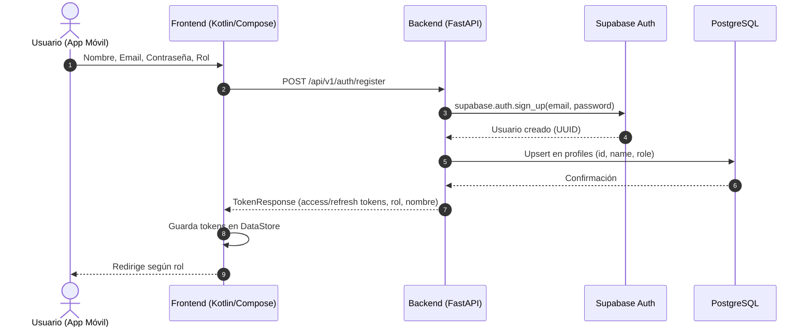
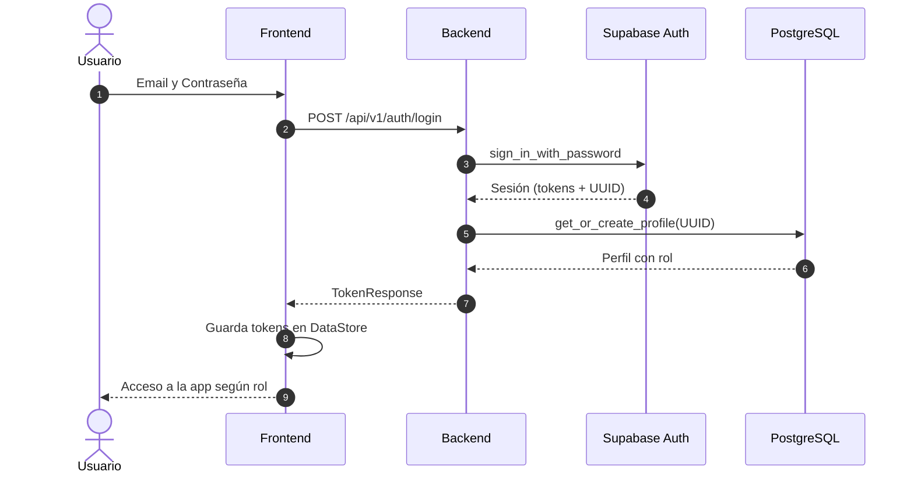
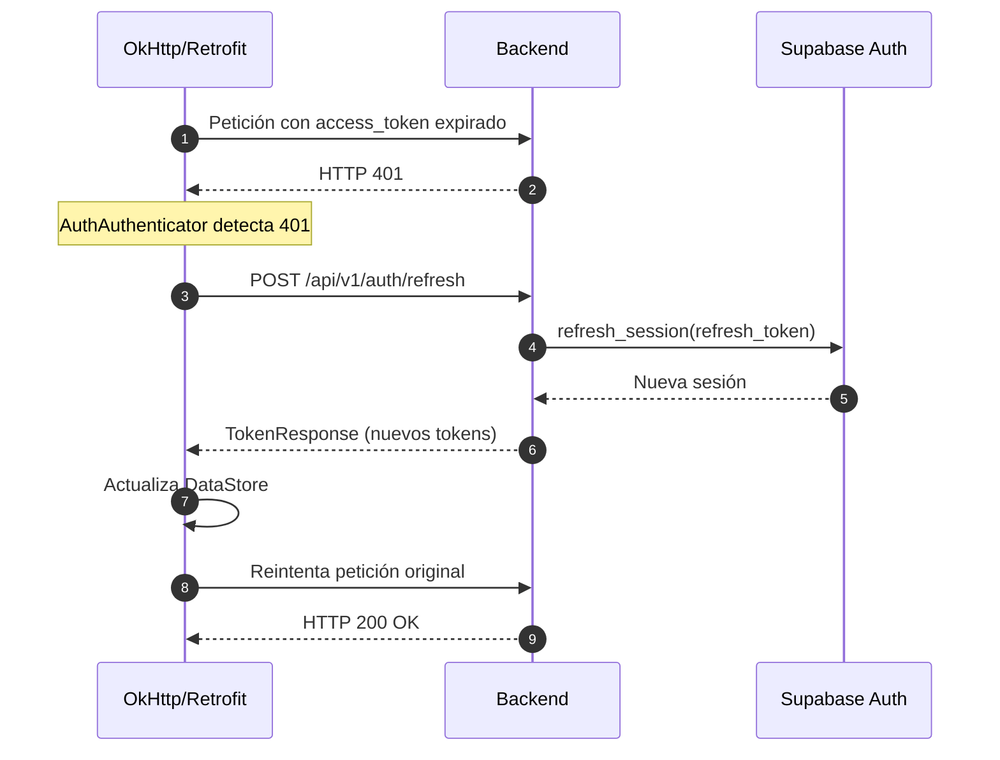
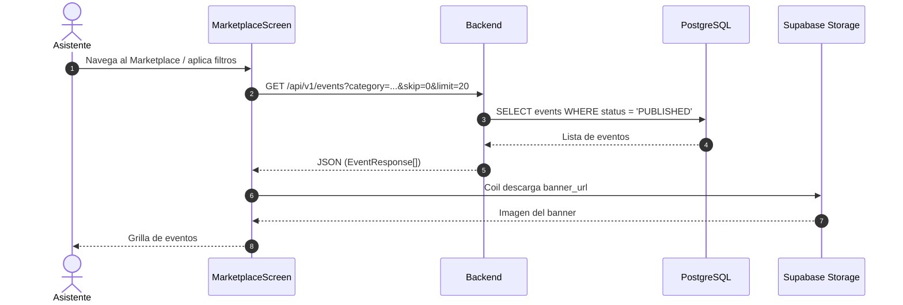
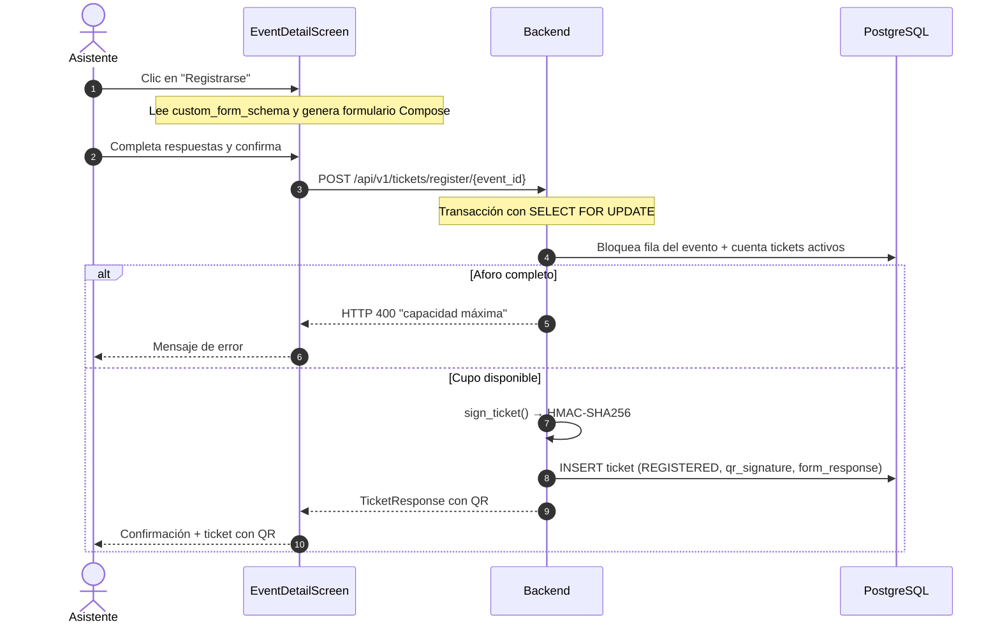
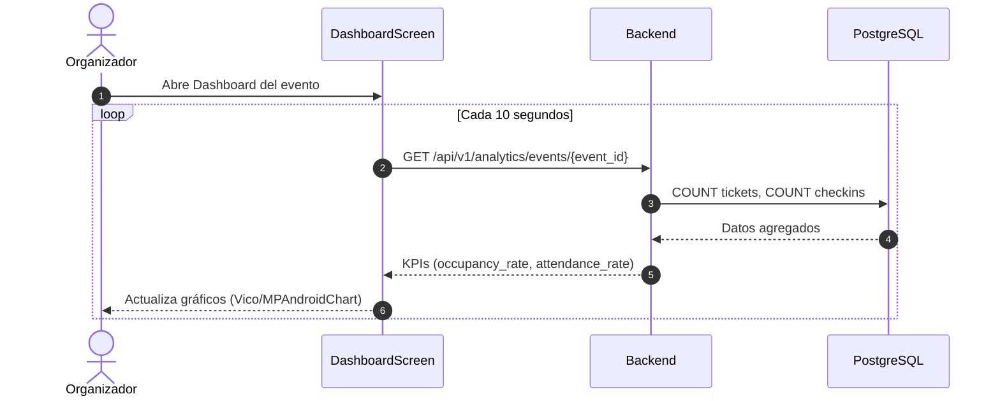
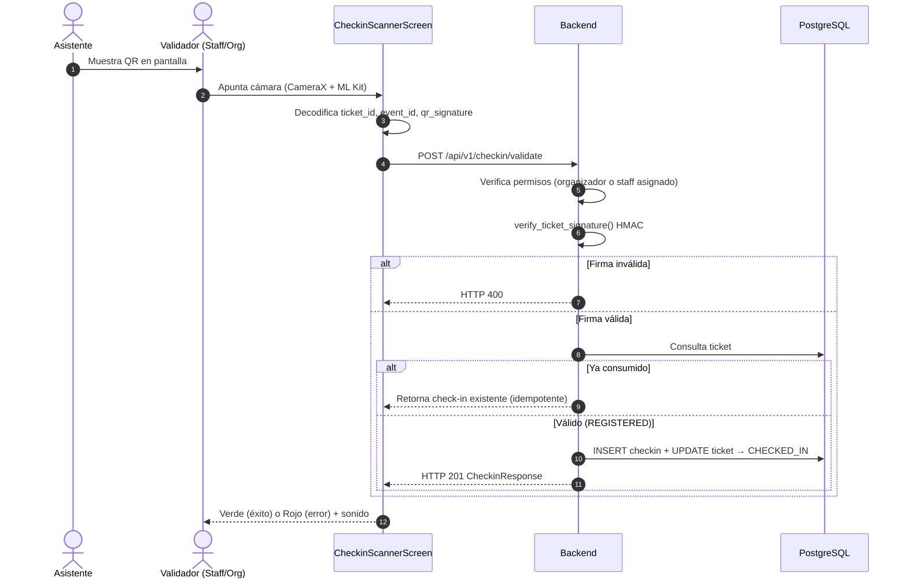
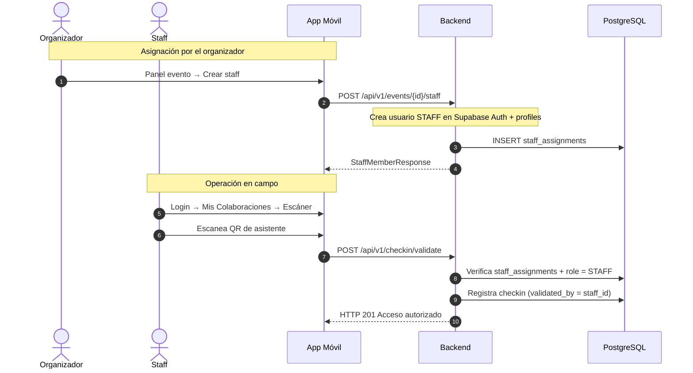

# Funcionalidades End-to-End

Este documento describe el funcionamiento completo de las principales características de **Quickvnt**, desde la interfaz móvil (Android/Kotlin) hasta el backend (Python/FastAPI) y la capa de datos (Supabase PostgreSQL + Auth).

---

## Índice

1. [Registro de usuario](#1-registro-de-usuario)
2. [Inicio de sesión](#2-inicio-de-sesión)
3. [Refresco del token de sesión](#3-refresco-del-token-de-sesión)
4. [Marketplace de eventos](#4-marketplace-de-eventos)
5. [Registro a un evento](#5-registro-a-un-evento)
6. [Métricas del organizador](#6-métricas-del-organizador)
7. [Generación, escaneo y validación de QR](#7-generación-escaneo-y-validación-de-qr)
8. [Asignación y flujo de staff](#8-asignación-y-flujo-de-staff)
9. [Seguridad en la transmisión de datos](#9-seguridad-en-la-transmisión-de-datos)
10. [Coil y carga de imágenes](#10-coil-y-carga-de-imágenes)
11. [Tecnología y seguridad de los QR](#11-tecnología-y-seguridad-de-los-qr)

---

## 1. Registro de usuario

### Descripción

Permite crear una cuenta eligiendo rol principal: `ATTENDEE` (asistente) u `ORGANIZER` (organizador). Las credenciales se gestionan en Supabase Auth; el rol de negocio se persiste en `profiles`.

### Flujo end-to-end



### Componentes

| Capa | Detalle |
|---|---|
| **Frontend** | `RegisterScreen`, `AuthApi`, `SessionManager` (DataStore) |
| **Backend** | `POST /api/v1/auth/register` en `app/auth/router.py` |
| **Datos** | `auth.users` (Supabase) + `profiles` (tabla de negocio) |

---

## 2. Inicio de sesión

### Descripción

Autenticación con email y contraseña. El backend actúa como puente hacia Supabase Auth, recupera tokens y sincroniza el perfil con el rol almacenado.

### Flujo end-to-end



### Componentes

| Capa | Detalle |
|---|---|
| **Frontend** | `LoginScreen`, navegación condicional por `role` |
| **Backend** | `POST /api/v1/auth/login` — crea perfil si no existe |
| **Datos** | Lectura/escritura en `profiles` |

---

## 3. Refresco del token de sesión

### Descripción

El `access_token` JWT tiene vida corta (~1 h). La app renueva silenciosamente usando el `refresh_token` cuando una petición recibe `401 Unauthorized`.

### Flujo end-to-end



### Componentes

| Capa | Detalle |
|---|---|
| **Frontend** | `AuthAuthenticator` + `AuthInterceptor` en OkHttp |
| **Backend** | `POST /api/v1/auth/refresh` |

---

## 4. Marketplace de eventos

### Descripción

Vitrina pública de eventos publicados. Soporta filtros por categoría, estado y paginación.

### Flujo end-to-end



### Componentes

| Capa | Detalle |
|---|---|
| **Frontend** | `MarketplaceScreen`, `MarketplaceViewModel`, Coil `AsyncImage` |
| **Backend** | `GET /api/v1/events` — endpoint público, paginación con `skip`/`limit` |
| **Datos** | Tabla `events`, banners en Supabase Storage |

---

## 5. Registro a un evento

### Descripción

Un asistente se inscribe respondiendo el formulario dinámico del organizador. El sistema valida transaccionalmente el aforo (`capacity`) y genera un ticket con QR firmado.

### Flujo end-to-end



### Componentes

| Capa | Detalle |
|---|---|
| **Frontend** | Formulario dinámico desde `custom_form_schema` (JSONB) |
| **Backend** | `POST /api/v1/tickets/register/{event_id}` — bloqueo pesimista con `with_for_update()` |
| **Datos** | `events` (capacity, schema) + `tickets` (form_response JSONB) |

---

## 6. Métricas del organizador

### Descripción

Dashboard con KPIs: capacidad, registrados, check-ins, tasa de ocupación y tasa de asistencia. Actualización por polling cada ~10 s.

### Flujo end-to-end



### Respuesta de ejemplo

```json
{
  "event_id": "uuid",
  "capacity": 500,
  "total_registered": 320,
  "total_checked_in": 280,
  "occupancy_rate_percent": 64.0,
  "attendance_rate_percent": 87.5,
  "status": "PUBLISHED"
}
```

---

## 7. Generación, escaneo y validación de QR

### Descripción

Los asistentes presentan su QR. Staff u organizador escanean con la cámara; el backend valida firma criptográfica y estado del ticket.

### Flujo end-to-end



### Componentes

| Capa | Detalle |
|---|---|
| **Frontend** | CameraX `PreviewView` + ML Kit + feedback visual/sonoro |
| **Backend** | `POST /api/v1/checkin/validate` — doble capa: firma + estado DB |
| **Datos** | `tickets` (actualización de status) + `checkins` (registro de acceso) |

---

## 8. Asignación y flujo de staff

### Descripción

El organizador crea cuentas de staff y las asigna a un evento. El staff asignado puede escanear QRs de ese evento.

### Flujo end-to-end



### Endpoints de staff

| Método | Endpoint | Rol | Acción |
|---|---|---|---|
| `GET` | `/api/v1/events/{id}/staff` | ORGANIZER | Listar staff del evento |
| `POST` | `/api/v1/events/{id}/staff` | ORGANIZER | Crear y asignar staff |
| `DELETE` | `/api/v1/events/{id}/staff/{user_id}` | ORGANIZER | Remover asignación |
| `GET` | `/api/v1/events/staff/mine` | STAFF | Eventos donde soy staff |

---

## 9. Seguridad en la transmisión de datos

1. **HTTPS/TLS 1.2+**: toda comunicación cifrada en tránsito.
2. **Credenciales en body POST**: email y contraseña nunca en query params ni URLs.
3. **Validación Pydantic**: esquemas `UserRegister` y `UserLogin` sanitizan entradas.
4. **Certificate Pinning** (opcional en producción): asocia la app al certificado SSL del backend.

---

## 10. Coil y carga de imágenes

**Coil** (Coroutines Image Loader) gestiona la descarga de banners:

- Componente `AsyncImage` en Compose.
- Caché en memoria (RAM) y disco (almacenamiento local).
- Cancelación automática según ciclo de vida de la pantalla.

```kotlin
AsyncImage(
    model = event.bannerUrl,
    contentDescription = "Banner del evento"
)
```

---

## 11. Tecnología y seguridad de los QR

### Generación

1. Se crea un `ticket_id` UUID único.
2. Payload: `{ ticket_id, event_id, user_id }`.
3. Firma **HMAC-SHA256** con `QR_JWT_SECRET` (clave solo en el servidor).
4. El string firmado se codifica en la imagen QR (`qrcode` + Pillow).

### Validación

1. El escáner extrae `ticket_id`, `event_id` y `qr_signature`.
2. El backend recalcula la firma y compara.
3. Consulta DB: ticket existe, no cancelado, no ya `CHECKED_IN`.
4. Un solo uso: tras el primer check-in, reintentos devuelven el registro existente (idempotencia).

### Anti-falsificación y anti-reutilización

| Amenaza | Mitigación |
|---|---|
| QR editado manualmente | Firma HMAC inválida → rechazo inmediato |
| Captura de pantalla compartida | Estado `CHECKED_IN` en DB → segundo escaneo bloqueado |
| QR de otro evento | Validación `event_id` en payload vs. ticket |

---

## Información del equipo

| | |
|---|---|
| **Grupo** | Quickvnt |
| **Salón** | 1SF-241 |

| # | Integrante | Cédula |
|---|---|---|
| 1 | Fong, Enrique | 4-829-300 |
| 2 | González, Jabneel | 8-990-229 |
| 3 | Guillén, Manuel | 8-1016-1618 |
| 4 | Lu, Joaquín | 8-1024-2466 |
| 5 | Santimateo, Diego | 9-764-2382 |
| 6 | Pimentel, David | 8-1010-750 |
