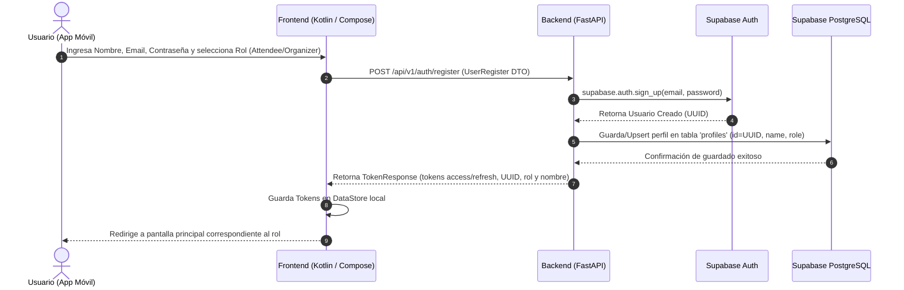
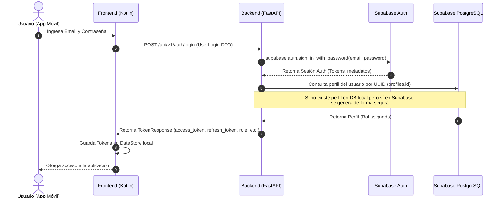
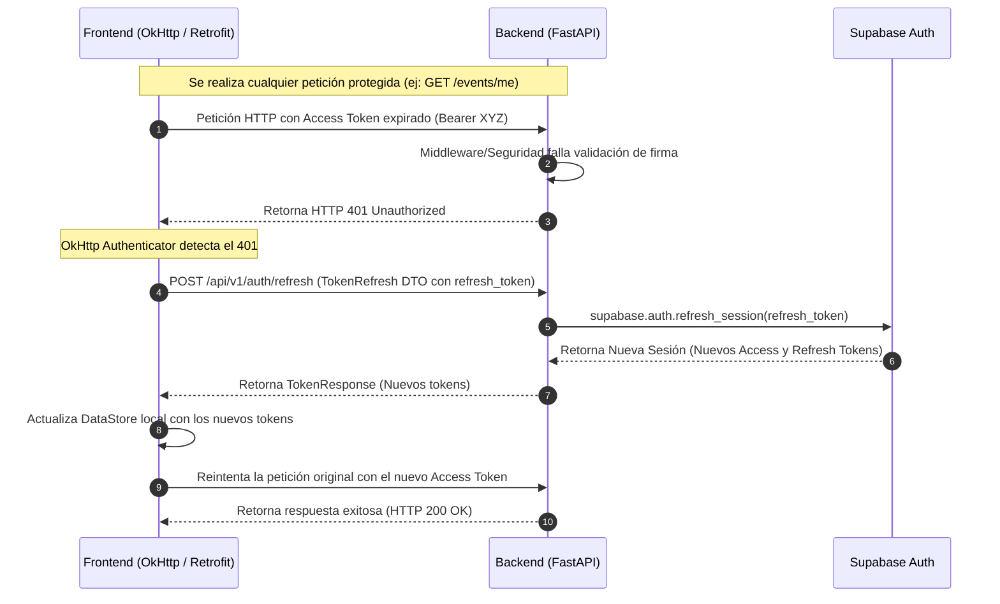
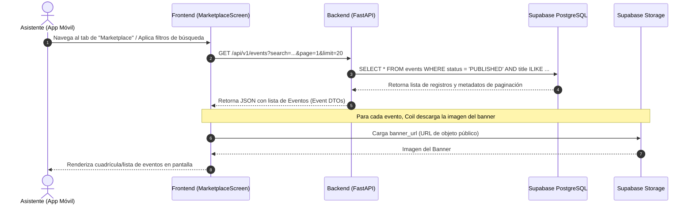
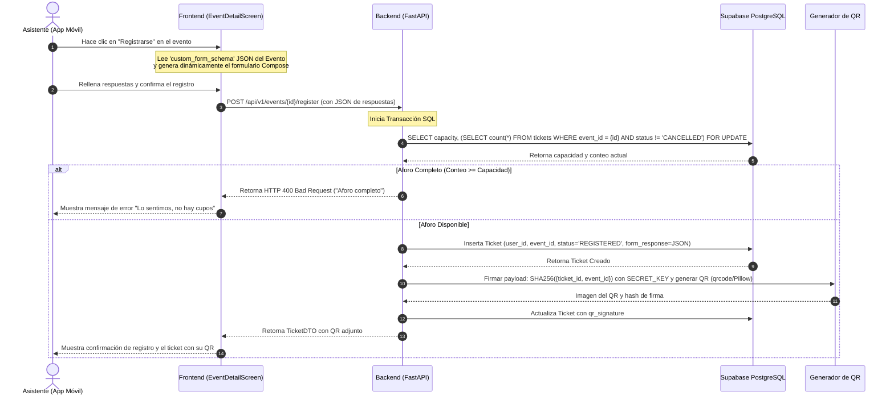
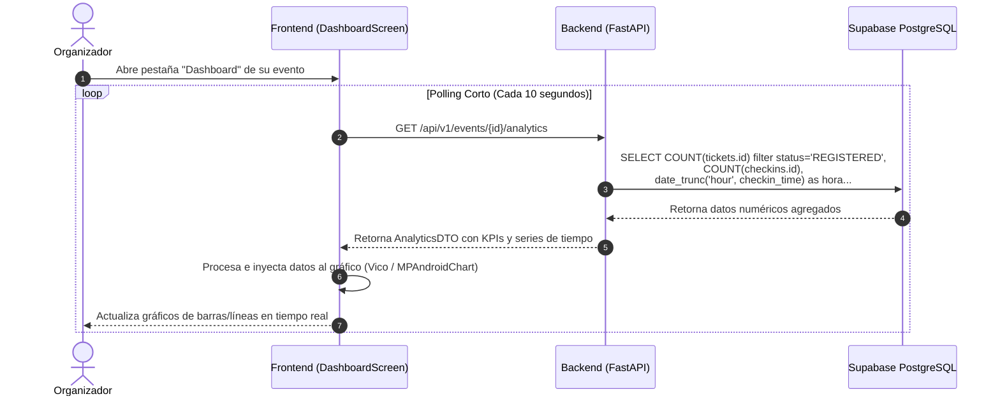
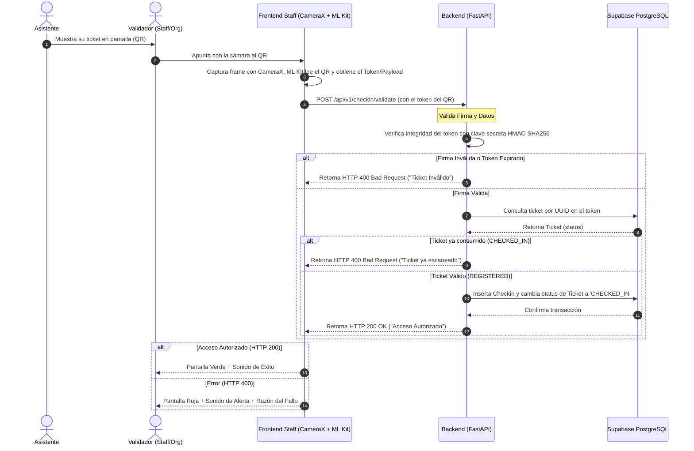
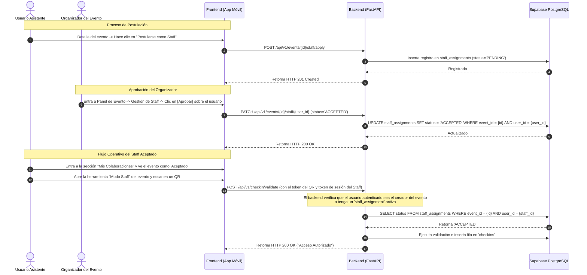

# Documentación de Funcionalidades End-to-End (MVP Quickvnt)

Este documento describe detalladamente el funcionamiento de las principales características del sistema **Quickvnt**, cubriendo todo el ciclo de vida de los datos, desde la interfaz de usuario en la aplicación móvil (Android/Kotlin) hasta el backend (Python/FastAPI) y la capa de base de datos y autenticación (Supabase PostgreSQL y Auth).

---

## Índice de Funcionalidades

1. [Registro de Usuario](#1-registro-de-usuario)
2. [Inicio de Sesión (Login)](#2-inicio-de-sesión-login)
3. [Refresco del Token de Sesión](#3-refresco-del-token-de-sesión)
4. [Marketplace de Eventos](#4-marketplace-de-eventos)
5. [Registro a un Evento (Aforo y Formulario Dinámico)](#5-registro-a-un-evento-aforo-y-formulario-dinámico)
6. [Métricas de Organizador (Dashboard)](#6-métricas-de-organizador-dashboard)
7. [Generación, Escaneo y Validación de QR](#7-generación-escaneo-y-validación-de-qr)
8. [Asignación y Flujo de Staff Temporal](#8-asignación-y-flujo-de-staff-temporal)
9. [Seguridad en la Transmisión de Datos Sensibles](#9-seguridad-en-la-transmisión-de-datos-sensibles)
10. [¿Qué es Coil y cómo optimiza la carga de imágenes?](#10-qué-es-coil-y-cómo-optimiza-la-carga-de-imágenes)
11. [Tecnología y Seguridad de los Códigos QR](#11-tecnología-y-seguridad-de-los-códigos-qr)

---

## 1. Registro de Usuario

### Descripción de la Funcionalidad
Permite a un nuevo usuario crear una cuenta en la aplicación. Debe elegir un rol principal (`ATTENDEE` para asistentes comunes o `ORGANIZER` para organizadores de eventos). El sistema asegura que las credenciales de autenticación se gestionen de manera segura en Supabase Auth y que el rol de negocio se almacene de manera persistente en la tabla local `profiles`.

### Diagrama de Flujo (End-to-End)


### Explicación Técnica

*   **Frontend (Kotlin / Android):**
    *   **Vista:** `RegisterScreen` de Jetpack Compose. Captura los datos del formulario de registro.
    *   **Networking:** Utiliza `AuthApi` de Retrofit para realizar la petición `POST /api/v1/auth/register`.
    *   **Almacenamiento Local:** Tras recibir una respuesta exitosa, `TokenResponse` se deserializa y los tokens (`access_token`, `refresh_token`) se almacenan de manera segura en `DataStore` mediante la clase de sesión de la aplicación (`SessionManager`).
*   **Backend (FastAPI):**
    *   **Endpoint:** `POST /api/v1/auth/register` en [auth/router.py](file:///c:/Users/joako/Documents/proyecto-final-dev-be/app/auth/router.py#L78).
    *   **Lógica:**
        1. Valida el rol solicitado (`ATTENDEE` u `ORGANIZER`).
        2. Llama al SDK de Supabase (`supabase_client.auth.sign_up`) para delegar el almacenamiento seguro de credenciales y encriptación de contraseña.
        3. Recibe el `UUID` generado por Supabase.
        4. Invoca la función `upsert_profile_for_register` para crear la fila en la tabla `profiles` vinculada al `auth.users.id` de Supabase.
*   **Capa de Datos:**
    *   **Tablas Involucradas:** `auth.users` (gestionada por Supabase) y `profiles` (tabla de negocio local de la aplicación).

---

## 2. Inicio de Sesión (Login)

### Descripción de la Funcionalidad
Permite a un usuario existente autenticarse utilizando su correo electrónico y contraseña. El backend actúa como puente hacia Supabase Auth, recupera los tokens correspondientes y carga el perfil de base de datos para sincronizar los permisos (roles) en el dispositivo móvil.

### Diagrama de Flujo (End-to-End)


### Explicación Técnica

*   **Frontend (Kotlin / Android):**
    *   **Vista:** `LoginScreen` (Compose).
    *   **Networking:** Llama al endpoint `/auth/login` mapeado en `AuthApi`.
    *   **Navegación:** Según el rol recibido (`role`), redirige al usuario a la experiencia del Asistente (Marketplace, Mis Tickets) o del Organizador (Panel de Eventos, Creación de Eventos).
*   **Backend (FastAPI):**
    *   **Endpoint:** `POST /api/v1/auth/login` en [auth/router.py](file:///c:/Users/joako/Documents/proyecto-final-dev-be/app/auth/router.py#L130).
    *   **Lógica:**
        1. Autentica con el SDK de Supabase: `sign_in_with_password`.
        2. Al verificar que las credenciales son válidas, recupera el UUID del usuario.
        3. Llama a `get_or_create_profile` para consultar la tabla `profiles`. Si el usuario se creó directamente en el panel de Supabase y no tiene un registro en la tabla `profiles` local del backend, se le crea un perfil básico de forma dinámica para evitar errores de consistencia.
*   **Capa de Datos:**
    *   **Tablas Involucradas:** `auth.users` y `profiles` (lectura o inserción inicial).

---

## 3. Refresco del Token de Sesión

### Descripción de la Funcionalidad
El `access_token` JWT emitido por Supabase tiene un ciclo de vida corto (típicamente 1 hora) por motivos de seguridad. Para evitar que el usuario deba iniciar sesión constantemente, la app móvil renueva silenciosamente el token en segundo plano usando el `refresh_token` almacenado cuando una petición de red falla debido a la expiración del token de acceso.

### Diagrama de Flujo (End-to-End)


### Explicación Técnica

*   **Frontend (Kotlin / Android):**
    *   **Networking:** Utiliza un `OkHttp Authenticator` personalizado (ej. `AuthAuthenticator`).
    *   **Intercepción:** Cuando una petición responde con código `401 Unauthorized`, el interceptor captura la llamada, lee el `refresh_token` guardado en el `DataStore`, realiza una petición síncrona a `POST /api/v1/auth/refresh` y, si es exitosa, guarda los nuevos tokens y le indica al motor de OkHttp que reintente la llamada original fallida.
*   **Backend (FastAPI):**
    *   **Endpoint:** `POST /api/v1/auth/refresh` en [auth/router.py](file:///c:/Users/joako/Documents/proyecto-final-dev-be/app/auth/router.py#L172).
    *   **Lógica:**
        1. Recibe el string del token de refresco en la carga útil (`TokenRefresh`).
        2. Invoca `supabase_client.auth.refresh_session(refresh_token)`.
        3. Extrae la información del perfil del usuario asociado a partir del UUID devuelto por Supabase para incluir el rol del usuario en la respuesta.
*   **Capa de Datos:**
    *   **Tablas Involucradas:** `profiles` (lectura rápida).

---

## 4. Marketplace de Eventos

### Descripción de la Funcionalidad
Es la vitrina pública donde se listan todos los eventos publicados por los organizadores. Cualquier usuario autenticado (incluso sin autenticar, según configuración del endpoint) puede buscar eventos por texto, filtrar por categorías y paginar a través de los resultados.

### Diagrama de Flujo (End-to-End)


### Explicación Técnica

*   **Frontend (Kotlin / Android):**
    *   **Vista:** `MarketplaceScreen` estructurada mediante una grilla/lista perezosa (`LazyVerticalGrid`).
    *   **Lógica:** `MarketplaceViewModel` implementa la paginación de datos para evitar descargas masivas de red.
    *   **Carga de Imágenes:** Usa **Coil** para cargar la URL del banner del evento de manera asíncrona, gestionando de forma automática el almacenamiento en caché local de las imágenes del servidor.
*   **Backend (FastAPI):**
    *   **Endpoint:** `GET /api/v1/events` en [events/router.py](file:///c:/Users/joako/Documents/proyecto-final-dev-be/app/events/router.py).
    *   **Filtros:** Acepta parámetros de consulta (query parameters) tales como `search`, `category`, `date_start`, `page` y `limit`.
    *   **Lógica de Datos:** Usa una sesión asíncrona de SQLAlchemy (`AsyncSession`) para consultar la tabla `events`, filtrando estrictamente por registros activos (`status == 'PUBLISHED'`) y aplicando índices optimizados sobre campos de búsqueda.
*   **Capa de Datos:**
    *   **Tablas Involucradas:** `events`.
    *   **Almacenamiento Físico:** Banners guardados en un bucket público de **Supabase Storage** y referenciados mediante `events.banner_url`.

---

## 5. Registro a un Evento (Aforo y Formulario Dinámico)

### Descripción de la Funcionalidad
Un asistente se inscribe a un evento del marketplace. El proceso requiere responder preguntas específicas (formulario personalizado) definidas previamente por el organizador del evento (ej: "¿Tienes alergias alimentarias?", "Talla de camiseta"). Además, el sistema asegura transaccionalmente que no se sobrepase el límite máximo de aforo (`capacity`) del evento.

### Diagrama de Flujo (End-to-End)


### Explicación Técnica

*   **Frontend (Kotlin / Android):**
    *   **Formulario Dinámico:** La UI analiza el campo `custom_form_schema` (un objeto JSON que define campos, tipos de datos y si son requeridos). Compose dibuja en tiempo de ejecución campos de texto, checkboxes o selectores en función de este esquema y empaqueta las respuestas en un mapa de datos que se envía como JSONB (`form_response`) en la petición de red.
*   **Backend (FastAPI):**
    *   **Endpoint:** `POST /api/v1/events/{id}/register` en [tickets/router.py](file:///c:/Users/joako/Documents/proyecto-final-dev-be/app/tickets/router.py).
    *   **Prevención de condiciones de carrera (Aforo):** El backend ejecuta una transacción SQL con bloqueo de lectura mediante `SELECT ... FOR UPDATE` (o aplicando constraints a nivel de base de datos) para asegurar que múltiples peticiones simultáneas no registren a más usuarios que la capacidad total permitida.
    *   **Generador QR:** En el módulo `tickets/qr.py`, se firma el payload con **HMAC-SHA256** utilizando una clave privada oculta en las variables de entorno del backend, previniendo falsificaciones de tickets en el proceso de check-in.
*   **Capa de Datos:**
    *   **Tablas Involucradas:** `events` (lectura de capacidad y esquema), `tickets` (inserción del ticket y respuestas en la columna JSONB `form_response`).

---

## 6. Métricas de Organizador (Dashboard)

### Descripción de la Funcionalidad
El organizador del evento puede analizar la evolución de su evento en tiempo real. La pantalla presenta estadísticas clave como el ritmo de registros, porcentaje de asistencia en relación a los registrados, y distribución horaria de check-ins para optimizar la entrada del público.

### Diagrama de Flujo (End-to-End)


### Explicación Técnica

*   **Frontend (Kotlin / Android):**
    *   **Representación Visual:** Utiliza librerías de gráficos avanzadas en Compose como **Vico** o **MPAndroidChart** para pintar series de tiempo (check-ins por hora) y gráficos circulares (tasa de asistencia).
    *   **Polling:** El `ViewModel` ejecuta un bucle asíncrono utilizando Coroutines (`delay(10_000)`) para llamar al endpoint repetidamente mientras la pantalla esté activa, logrando un comportamiento en "tiempo real" simple y eficiente sin la sobrecarga de conexiones WebSockets o servidores Redis en el MVP.
*   **Backend (FastAPI):**
    *   **Endpoint:** `GET /api/v1/events/{id}/analytics` en [analytics/router.py](file:///c:/Users/joako/Documents/proyecto-final-dev-be/app/analytics/router.py).
    *   **Lógica de Datos:** Para mantener el rendimiento de la base de datos, el backend no descarga los registros crudos de tickets. Realiza consultas SQL agregadas (`COUNT`, `SUM`, agrupaciones por fecha y hora) a través de SQLAlchemy, aprovechando los índices en `tickets(event_id, status)` y `checkins(checkin_time)`.
*   **Capa de Datos:**
    *   **Tablas Involucradas:** `events`, `tickets` y `checkins`.

---

## 7. Generación, Escaneo y Validación de QR

### Descripción de la Funcionalidad
Es el núcleo de la gestión de acceso al evento en campo. Los asistentes presentan su QR generado por la aplicación. El staff (o el organizador) utiliza la cámara de su dispositivo móvil para escanear el QR. La app decodifica la información y solicita al backend la validación de acceso.

### Diagrama de Flujo (End-to-End)


### Explicación Técnica

*   **Frontend (Kotlin / Android):**
    *   **Cámara:** Emplea **Jetpack CameraX`** (`PreviewView` e `ImageAnalysis`) para transmitir frames de la cámara del validador en segundo plano de forma eficiente.
    *   **Decodificación:** Los frames se envían a la librería **Google ML Kit Barcode Scanning**, la cual detecta y decodifica el código QR en milisegundos sin consumir exceso de memoria.
    *   **UX del Escáner:** Al recibir la respuesta del backend, la app reproduce tonos de audio distintivos y cambia el color de fondo de la pantalla momentáneamente para agilizar el flujo de personas en la entrada.
*   **Backend (FastAPI):**
    *   **Endpoint:** `POST /api/v1/checkin/validate` en [checkin/router.py](file:///c:/Users/joako/Documents/proyecto-final-dev-be/app/checkin/router.py).
    *   **Doble Capa de Seguridad:** 
        1. **Firma criptográfica:** Primero, el backend ve que el QR no sea una falsificación verificando la firma HMAC localmente.
        2. **Estado de base de datos:** El backend comprueba en base de datos que el ticket pertenezca al evento y que su estado no sea `CHECKED_IN`. Esto impide que un asistente envíe una captura de pantalla de su QR a varios amigos para que entren múltiples personas con la misma entrada.
*   **Capa de Datos:**
    *   **Tablas Involucradas:** `tickets` (para actualización de estado) y `checkins` (inserción del registro de acceso).

---

## 8. Asignación y Flujo de Staff Temporal

### Descripción de la Funcionalidad
El organizador de un evento de gran envergadura necesita apoyo para validar las entradas de los asistentes. Cualquier usuario de la plataforma puede postularse como Staff de un evento específico. Si el organizador aprueba su postulación, el usuario adquiere un rol de staff **contextual** para dicho evento, lo que le permite acceder al escáner de QR y realizar check-ins en nombre del organizador, pero limitando su acceso a métricas financieras o edición del evento.

### Diagrama de Flujo (End-to-End)


### Explicación Técnica

*   **Frontend (Kotlin / Android):**
    *   **Navegación Condicional:** La sección "Mis Colaboraciones" filtra y lista los eventos donde el usuario ha postulado. Si la asignación se encuentra en estado `ACCEPTED`, habilita el botón para abrir la pantalla de escaneo (`CheckinScannerScreen`), enviando el `eventId` como argumento en la ruta de navegación de Jetpack Compose (`composable("staff_scanner/{eventId}")`).
*   **Backend (FastAPI):**
    *   **Endpoints:**
        *   `POST /api/v1/events/{id}/staff/apply` en [events/router.py](file:///c:/Users/joako/Documents/proyecto-final-dev-be/app/events/router.py) (Postularse).
        *   `PATCH /api/v1/events/{id}/staff/{user_id}` (Actualizar estado a `ACCEPTED` o `REJECTED` por parte del organizador).
    *   **Control de Acceso Contextual:** Cuando se llama a `/checkin/validate`, la dependencia de seguridad comprueba el ID del usuario que escanea. Valida que sea el creador del evento o que exista una fila en `staff_assignments` con `event_id` y `user_id` de la petición donde `status` sea estrictamente igual a `ACCEPTED`.
*   **Capa de Datos:**
    *   **Tablas Involucradas:** `staff_assignments` (con columnas de control `status` y `assigned_at`) y `checkins` (columna `validated_by` apunta al UUID del Staff asignado que efectuó el escaneo).

---

## 9. Seguridad en la Transmisión de Datos Sensibles

Para enviar información crítica (como el correo electrónico y la contraseña del usuario) desde la aplicación móvil hacia la API de FastAPI sin comprometer la seguridad, se aplican los siguientes estándares de la industria:

1.  **Encriptación en Tránsito (HTTPS/TLS):**
    *   Toda la comunicación entre la aplicación Android y el backend se realiza bajo el protocolo **HTTPS** cifrado con **TLS 1.2 o 1.3**.
    *   Esto garantiza que los datos sensibles viajen encriptados a través de la red, impidiendo ataques de intermediario (Man-in-the-Middle) que intenten rastrear o capturar paquetes (sniffing).
2.  **Uso de Métodos Seguros en el Cuerpo de la Petición (Request Body):**
    *   El email y la contraseña se envían exclusivamente a través del método **`POST`** estructurado dentro del cuerpo de la solicitud en formato JSON.
    *   **Nunca** se envían datos sensibles en los parámetros de la URL (query parameters) o en las rutas del endpoint, ya que las URLs suelen quedar registradas en texto plano en los logs de los servidores web, balanceadores de carga y proxies de red.
3.  **Modelos de Datos Tipados y Validados (Pydantic):**
    *   En el backend, los esquemas de entrada como `UserRegister` y `UserLogin` validan la estructura y tipo de los campos antes de cualquier procesamiento, sanitizando entradas sospechosas.
4.  **Certificate Pinning (Opcional para producción):**
    *   En el cliente de red de la aplicación (OkHttpClient / Retrofit), se puede configurar *Certificate Pinning*, lo que asocia la aplicación exclusivamente a la clave pública del certificado SSL del backend. Esto evita que la app acepte certificados emitidos por entidades no autorizadas.

---

## 10. ¿Qué es Coil y cómo optimiza la carga de imágenes?

En la aplicación móvil (Android/Kotlin), las imágenes de los banners de eventos no se descargan de forma manual. En su lugar, se utiliza **Coil** (Coroutines Image Loader).

*   **¿Qué es?:** Coil es una biblioteca de carga de imágenes moderna y ligera para Android, diseñada específicamente para Kotlin y construida sobre **Kotlin Coroutines**.
*   **¿Por qué se utiliza en Quickvnt?:**
    1.  **Integración Nativa con Compose:** Proporciona componentes declarativos como `AsyncImage` que permiten renderizar una imagen de internet pasándole simplemente la URL:
        ```kotlin
        AsyncImage(
            model = event.bannerUrl,
            contentDescription = "Banner del evento"
        )
        ```
    2.  **Gestión Automática de Caché:** Coil gestiona dos niveles de caché:
        *   *Caché en Memoria (Memory Cache):* Mantiene la imagen decodificada en memoria RAM para mostrarla instantáneamente si el usuario vuelve a verla.
        *   *Caché en Disco (Disk Cache):* Guarda el archivo binario de la imagen en el almacenamiento local del teléfono para evitar volver a consumar megabytes de datos móviles.
    3.  **Ciclo de Vida Inteligente (Lifecycle-aware):** Coil detecta cuando un elemento visual sale de la pantalla o la pantalla se destruye y cancela automáticamente la descarga de red en curso, lo que optimiza la batería y previene fugas de memoria (memory leaks).

---

## 11. Tecnología y Seguridad de los Códigos QR

El control de accesos se basa en la lectura rápida de códigos QR. A continuación se explica su funcionamiento tecnológico y cómo se garantiza su integridad y unicidad.

### ¿Cómo funciona un Código QR?
Un código QR (Quick Response) es una matriz bidimensional de puntos (módulos) de contraste claro y oscuro que codifica información textual. En lugar de transmitir datos binarios complejos, el código QR de Quickvnt contiene un **String firmado criptográficamente** que actúa como un token de acceso de un solo uso.

### ¿Cómo se hace para que cada QR sea diferente y seguro?

1.  **Generación de un Payload Único:**
    *   Cuando el asistente se registra, el backend genera un UUID de ticket aleatorio (`ticket_id`).
    *   El payload contiene datos no repetibles: `{ "ticket_id": "<UUID>", "event_id": "<UUID>", "exp": <timestamp> }`. Al cambiar el `ticket_id` para cada registro, la imagen visual del código QR resultante siempre será única, incluso si el mismo usuario se inscribe a múltiples eventos.
2.  **Firma Criptográfica (HMAC-SHA256):**
    *   Para evitar que un usuario altere la información del QR (por ejemplo, editando el texto del QR para cambiar el ID del ticket por otro), el backend firma el payload usando el algoritmo **HMAC-SHA256** con una clave secreta (`SECRET_KEY`) que solo reside en las variables de entorno del servidor.
    *   El QR final codifica un string con la estructura: `base64(payload) + "." + firma_hmac`.
3.  **Representación Visual del QR (Backend):**
    *   El backend utiliza la librería de Python `qrcode` para traducir el string firmado en una matriz de bytes.
    *   Luego, la librería `Pillow` (procesamiento de imágenes) renderiza esta matriz en una imagen de formato PNG/JPEG que es enviada a la aplicación móvil como respuesta.
4.  **Escaneo y Decodificación en el Cliente:**
    *   La aplicación móvil del Staff utiliza la cámara a través de **CameraX** y procesa cada frame con **Google ML Kit Barcode Scanning**.
    *   ML Kit detecta el patrón visual, extrae el string firmado y lo envía al endpoint `/api/v1/checkin/validate`.
5.  **Validación de un Solo Uso (Anti-Reutilización):**
    *   Al recibir el string, el backend primero verifica que la firma criptográfica sea válida con la clave secreta. Si el string fue alterado por un usuario, la firma no coincidirá y se denegará el acceso de forma inmediata.
    *   Si la firma es válida, el backend consulta la base de datos para verificar que el ticket con ese UUID exista, corresponda al evento correcto y que su columna `status` no sea `CHECKED_IN`. Si ya fue consumido, rechaza el acceso, impidiendo que el mismo código QR sea reutilizado o duplicado.

---

## Información del equipo

| | |
|---|---|
| **Grupo** | Quickvnt |
| **Salón** | 1SF-241 |

| # | Integrante | Cédula |
|---|---|---|
| 1 | Fong, Enrique | 4-829-300 |
| 2 | González, Jabneel | 8-990-229 |
| 3 | Guillén, Manuel | 8-1016-1618 |
| 4 | Lu, Joaquín | 8-1024-2466 |
| 5 | Santimateo, Diego | 9-764-2382 |
| 6 | Pimentel, David | 8-1010-750 |
